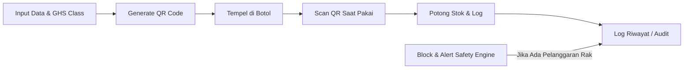

### 1. Manajemen Master Data & Labelling GHS (GHS Standard)

Setiap bahan kimia atau alat yang dimasukkan ke sistem wajib memiliki atribut keselamatan standar

### 2. Engine Matriks Kompabilitas Keselamatan (OSHA Standard)

Backend memiliki rules table bawaan yang mencatat pasangan bahan yang dilarang

**Standard yang digunakan**: **Chemical Incompatibility Matrix**(OSHA/EPA)

### 3. QR Code Generator & Quick Scan Log

Memangkas user friction dan mempercepat pencatatan petugas lab dengan cara:
* Auto-Generate QR: Ketika barang berhasil didaftarkan, sistem otomatis membuat stiker QR Code unik khusus untuk barang tersebut yang bisa dicetak
* Saat QR di-scan lewat kamera HP/webcam, web langsung membuka modal ringkas. User tinggal memasukkan volume/jumlah yang dipakai dan ID Eksperimen/penggunaan lab, lalu klik [Submit] unutk memotong stok otomatis.

### 4. Peringatan Stok Minimal & Kadaluarsa (ISO Standard 17025)
Di dashboard, bahan yang memasuki H-30 tanggal kadaluarsa atau stoknya di bawah batas minimal (minimum reorder point) akan diberi tanda/filter khusus berwarna kuning/merah.

SEHINGGA BISA MENCEGAH PENGGUNAAN BAHAN YANG SUDAH KADALUARSA SAAT PROSES QUICK SCAN

### 5. Audit Trail & Log Riwayat Penggunaan (ISO Standard 17025)

Catatan riwayat lengkap yang tidak bisa dibuah atau dihapus (Immutable log)

* Tabel riwayat transaksi yang mencatat secara otomatis: Siapa saja yang mengambil, Bahan apa, berapa banyak, kapan (Timestamp), dan untuk Proyek/Eksperimen apa
* Fitur untuk mengekspor riwayat ini ke format CSV/Excel untuk kebutuhan pelaporan audit

### 6. Keamanan Akun & Non-Repudiation (ISO 17025)

Untuk menjamin integritas riwayat penggunaan, sistem menerapkan sistem hashing pada PIN dan mekanisme Force Change PIN. Pengguna baru atau pengguna yang PIN-nya di-reset oleh Admin diwajibkan untuk mengganti PIN sementara mereka dengan PIN rahasia saat login pertama kali, sehingga admin tidak memiliki akses ke akun pengguna lab.

alurnya:

