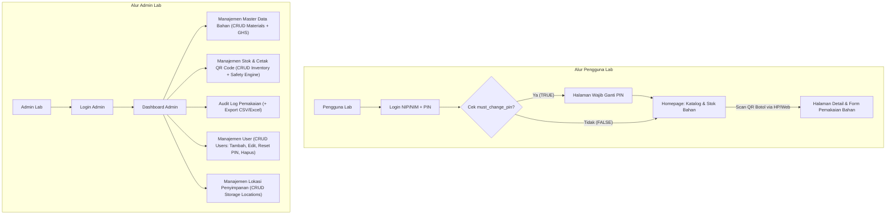

# MVP 1 3 Wireframe & User Flow

**Alur Sistem (User Flow)**

---

## Wireframe 1: Portal Pengguna Lab (Auth & Ketersediaan Bahan)

**1. Layar Login:**

- **Form Sederhana:** Field NIP/NIM dan PIN (4 Digit).

- **Manajemen Sesi:** Saat berhasil login, Backend menset HttpOnly Cookie yang berlaku selama 30 hari.

- **Autentikasi:** Menggunakan token JWT.

**2. Homepage Pengguna (Catalog & Search):**

- **Bar Pencarian:** Fitur untuk mencari nama reagen atau bahan kimia.

- **Daftar / Kartu Bahan:** Menampilkan detail ringkas Nama Bahan, Lokasi rak, dan sisa stok saat ini.

- **Fitur Scan:** Terdapat tombol/scanner khusus untuk memindai stiker QR Code.

**3. Layar Wajib Ganti PIN (Force Change PIN):**
- **Trigger**: Muncul otomatis setelah login jika status `must_change_pin = TRUE`. Pengguna tidak bisa mengakses halaman lain (Katalog/Scan) sebelum menyelesaikan form ini.
- **Form**: Terdiri dari 2 input: "PIN Baru (4 Digit)" dan "Konfirmasi PIN Baru".
- **Action**: Saat disubmit, sistem akan memperbarui hash PIN di database, mengubah must_change_pin menjadi FALSE, lalu me-redirect pengguna ke Homepage
---

## Wireframe 2: Halaman Scan QR & Form Pemakaian

**1. Trigger Buka Halaman:**

- Pengguna mengarahkan kamera HP atau Web scanner ke stiker QR code botol (URL contoh: `[https://app.com/lab/chemicals/CHEM-9921](https://app.com/lab/chemicals/CHEM-9921)`).

**2. Detail & Halaman Catat (Protected Route):**

- **UX Autentikasi:** Jika cookie 30 hari masih aktif, halaman detail bahan langsung terbuka. Jika belum login, sistem mengarahkan pengguna ke Layar Login terlebih dahulu, lalu otomatis _redirect_ ke halaman bahan tersebut setelah PIN dimasukkan.

- **Informasi Detail Bahan:** Menampilkan Nama, Rumus Kimia, Masa Kadaluarsa, dan Sisa Stok di layar.

- **Banner Warning OSHA:** Penanda visual peringatan jika bahan tergolong reaktif atau inkompatibel dengan kelompok bahan tertentu secara umum.

- **Validasi Kadaluarsa (ISO 17025):** Jika tanggal hari ini melewati masa kadaluarsa atau status bahan adalah `EXPIRED`, sistem akan menampilkan Banner Merah "Bahan Kadaluarsa" dan menonaktifkan (_disable_) tombol Submit pemakaian.

- **Form Input Pemakaian:** Terdapat input angka jumlah pemakaian (misal `24.4`), pilihan satuan (`mL`/`gram`), dan sebuah _dropdown_ wajib untuk memilih Kategori Kegiatan (Praktikum, Persiapan Reagen, Penelitian, Pengujian Sampel, Maintenance Alat, Lainnya), beserta tombol Submit Catat.

---

## Wireframe 3: Dashboard & Management Admin

**1. Layar Login Admin:**

- Form masuk khusus admin menggunakan Email dan Password.

**2. Dashboard Overview:**

- Menampilkan ringkasan total stok bahan di laboratorium.

- Menampilkan peringatan (_alert_) untuk stok tipis dan bahan yang mendekati H-30 masa kadaluarsa (Standar ISO 17025).

**3. Fitur Management:**

- **Master Data Bahan (CRUD Materials):** Admin dapat menambah, mengedit, melihat detail, dan menghapus data bahan kimia. Setiap bahan memiliki atribut Nama, Rumus Kimia, Nomor CAS, Satuan, Batas Stok Minimum, dan klasifikasi GHS (multi-select dari referensi GHS). Penghapusan dibatasi jika masih ada botol aktif.

- **Stok & Inventori (CRUD Inventory):** Admin dapat mendaftarkan botol/wadah fisik baru, termasuk memilih material, lokasi penyimpanan, kuantitas awal, nomor batch, dan tanggal kadaluarsa. Sistem memiliki **Safety Engine** yang akan memblokir penyimpanan jika bahan diletakkan di rak/lokasi yang melanggar matriks inkompatibilitas keselamatan OSHA. QR Code otomatis dibuat saat item baru didaftarkan dan dapat dicetak sebagai stiker. Admin juga dapat melakukan restock, adjustment, pemindahan lokasi, dan disposal item.

- **Audit Log:** Tabel riwayat transaksi _immutable_ yang mencatat Siapa pengguna lab, Kategori Kegiatan, Bahan yang dipakai, Jumlah perubahan stok, dan Timestamp kejadian. Terdapat tombol Export ke CSV/Excel untuk mempermudah pelaporan audit.

- **Manajemen User (CRUD Users):** Admin dapat menambah, mengedit, melihat detail, dan menghapus pengguna (baik Admin maupun Pengguna Lab). Untuk pengguna lab baru, input Nama, NIP/NIM, dan PIN 4-digit. Admin dapat me-reset PIN pengguna lab; saat PIN di-reset, flag `must_change_pin` diaktifkan kembali sehingga pengguna wajib ganti PIN saat login berikutnya (non-repudiation ISO 17025).

- **Manajemen Lokasi Penyimpanan (CRUD Storage Locations):** Admin dapat menambah, mengedit, dan menghapus lokasi penyimpanan (Ruangan, Lemari, Rak). Penghapusan dibatasi jika masih ada item inventori aktif di lokasi tersebut.
