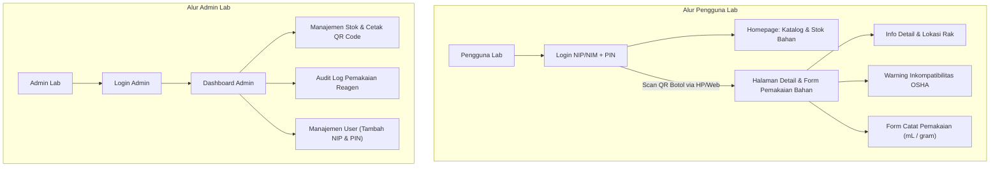

# MVP 1 3 Wireframe & User Flow

## Wireframe 1: Portal Pengguna Lab (Auth & Ketersediaan Bahan)

### 1. Layar Login:

- Form Sederhana: Field NIP/NIM dan PIN (4 Digit)
- Saat berhasil login: Backend menset HttpOnly Cookie (berlaku 30 hari)

Auth: Pakai JWT

### 2. Homepage Pengguna (Catalog & Search):

- Bar Pencarian: Cari nama reagen/bahan kimia
- Daftar / kartu bahan: menampilkan Nama Bahan, Lokasi, dan sisa stok saat ini
- Scanner untuk scan QR Code

## Wireframe 2: Halaman Scan QR & Form Pemakaian

### 1. Trigger

pengguna mengarahkan kamera HP/Web scanner ke stiker QR code botol (URL contoh: `https://app.com/lab/chemicals/CHEM-9921](https://app.com/lab/chemicals/CHEM-9921`)

### 2. Detail & Halaman Catat (Protected Route):

- **UX**: Jika cookie 30 hari masih aktif, halaman detail bahan langsung terbuka. Jika belum login, sistem mengarahkan ke Layar Login dulu, lalu otomatis redirect ke halaman bahan tersebut setelah PIN dimasukkan.
- **Informasi di Layar**:
  - Detail Bahan (Nama, Rumus Kimia, Masa Kadaluarsa, Sisa Stok).
  - **Banner Warning OSHA**: Penanda visual jika bahan tergolong reaktif/inkompatibel dengan kelompok bahan tertentu
  - **Form Input Pemakaian**: Input angka (misal `24.4`) dan pilihan satuan (`mL`/`gram`), tombol Submit Catat

## Wireframe 3: Dashboard & Management Admin

1. Layar login admin: Email & Password
2. **Dashboard Overview**
   - Ringkasan stok, stok tipis, dan mendekati kadaluarsa
3. Fitur Management:
   - Stok & QR Code: CRUD bahan kimia, upload data, dan tombol cetak stiker QR Code
   - Audit Log: Tabel riwayat transaksi (Siapa, Kapan, Bahan Apa, Berapa Banyak).
   - Manajemen User: Form daftarkan Pengguna Lab baru (Input Nama, NIP/NIM, dan PIN 4-digit)
