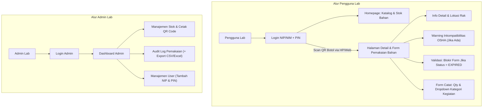

# MVP 1 3 Wireframe & User Flow

**Alur Sistem (User Flow)**

---

## Wireframe 1: Portal Pengguna Lab (Auth & Ketersediaan Bahan)

**1. Layar Login:**

- **Form Sederhana:** Field NIP/NIM dan PIN (4 Digit).

- **Manajemen Sesi:** Saat berhasil login, Backend menset HttpOnly Cookie yang berlaku selama 30 hari.

- **Autentikasi:** Menggunakan token JWT.

**2. Homepage Pengguna (Catalog & Search):**

- **Bar Pencarian:** Fitur untuk mencari nama reagen atau bahan kimia.

- **Daftar / Kartu Bahan:** Menampilkan detail ringkas Nama Bahan, Lokasi rak, dan sisa stok saat ini.

- **Fitur Scan:** Terdapat tombol/scanner khusus untuk memindai stiker QR Code.

---

## Wireframe 2: Halaman Scan QR & Form Pemakaian

**1. Trigger Buka Halaman:**

- Pengguna mengarahkan kamera HP atau Web scanner ke stiker QR code botol (URL contoh: `[https://app.com/lab/chemicals/CHEM-9921](https://app.com/lab/chemicals/CHEM-9921)`).

**2. Detail & Halaman Catat (Protected Route):**

- **UX Autentikasi:** Jika cookie 30 hari masih aktif, halaman detail bahan langsung terbuka. Jika belum login, sistem mengarahkan pengguna ke Layar Login terlebih dahulu, lalu otomatis _redirect_ ke halaman bahan tersebut setelah PIN dimasukkan.

- **Informasi Detail Bahan:** Menampilkan Nama, Rumus Kimia, Masa Kadaluarsa, dan Sisa Stok di layar.

- **Banner Warning OSHA:** Penanda visual peringatan jika bahan tergolong reaktif atau inkompatibel dengan kelompok bahan tertentu secara umum.

- **Validasi Kadaluarsa (ISO 17025):** Jika tanggal hari ini melewati masa kadaluarsa atau status bahan adalah `EXPIRED`, sistem akan menampilkan Banner Merah "Bahan Kadaluarsa" dan menonaktifkan (_disable_) tombol Submit pemakaian.

- **Form Input Pemakaian:** Terdapat input angka jumlah pemakaian (misal `24.4`), pilihan satuan (`mL`/`gram`), dan sebuah _dropdown_ wajib untuk memilih Kategori Kegiatan (Praktikum, Persiapan Reagen, Penelitian, Pengujian Sampel, Maintenance Alat, Lainnya), beserta tombol Submit Catat.

---

## Wireframe 3: Dashboard & Management Admin

**1. Layar Login Admin:**

- Form masuk khusus admin menggunakan Email dan Password.

**2. Dashboard Overview:**

- Menampilkan ringkasan total stok bahan di laboratorium.

- Menampilkan peringatan (_alert_) untuk stok tipis dan bahan yang mendekati H-30 masa kadaluarsa (Standar ISO 17025).

**3. Fitur Management:**

- **Stok & QR Code:** Terdapat form CRUD bahan kimia, fasilitas _upload_ data, dan tombol cetak stiker QR Code. Sistem memiliki _Safety Engine_ yang akan memblokir (_alert_) penyimpanan jika bahan diletakkan di rak/lokasi yang melanggar matriks inkompatibilitas keselamatan OSHA.

- **Audit Log:** Tabel riwayat transaksi _immutable_ yang mencatat Siapa pengguna lab, Kategori Kegiatan, Bahan yang dipakai, Jumlah perubahan stok, dan Timestamp kejadian. Terdapat tombol Export ke CSV/Excel untuk mempermudah pelaporan audit.

- **Manajemen User:** Form untuk mendaftarkan Pengguna Lab baru yang membutuhkan input Nama, NIP/NIM, dan PIN 4-digit
